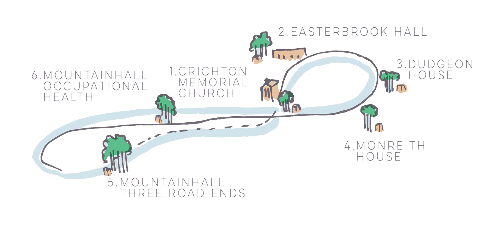

__In Dumfries, more than 125 trees are planted__ at six locations across The Crichton Trust and NHS Mountainhall. Altogether, the six plantings create a walking loop which takes approximately one hour to walk, reflecting the one hour for exercise which was allowed during the first Lockdown in the Spring of 2020.

Each of the six plantings is accompanied by a sandstone marker, and each marker has been inscribed with handwritten stories of loss and resilience gathered on postcards during [Phase 1](../../about/phase-1) of the project, when the idea for the forest was being co-designed.
The six plantings in Dumfries can be found at:

1. __[Crichton Memorial Church](https://maps.app.goo.gl/LMnXBvnKiYz8yxRy8)__
2. __[Easterbrook Hall](https://maps.app.goo.gl/MVZcmx5A92bUCNLv5)__
3. __[Dudgeon House](https://maps.app.goo.gl/jKqA3PfyY3NnQEmw7)__
4. __[Monreith House](https://maps.app.goo.gl/EzfoExevsjgoY6DH9)__
5. __[Occupational Health at NHS Mountainhall Treatment Centre](https://maps.app.goo.gl/hsu6XgyoipbkRTRD6)__
6. __[Three Road Ends at Mountainhall Treatment Centre](https://maps.app.goo.gl/hCNMzrVqzsymcRLV8?g_st=iw)__

<!-- <a class="link" href='../events/dumfries'><b>See also: </b>Events at Dumfries sites.</a> -->